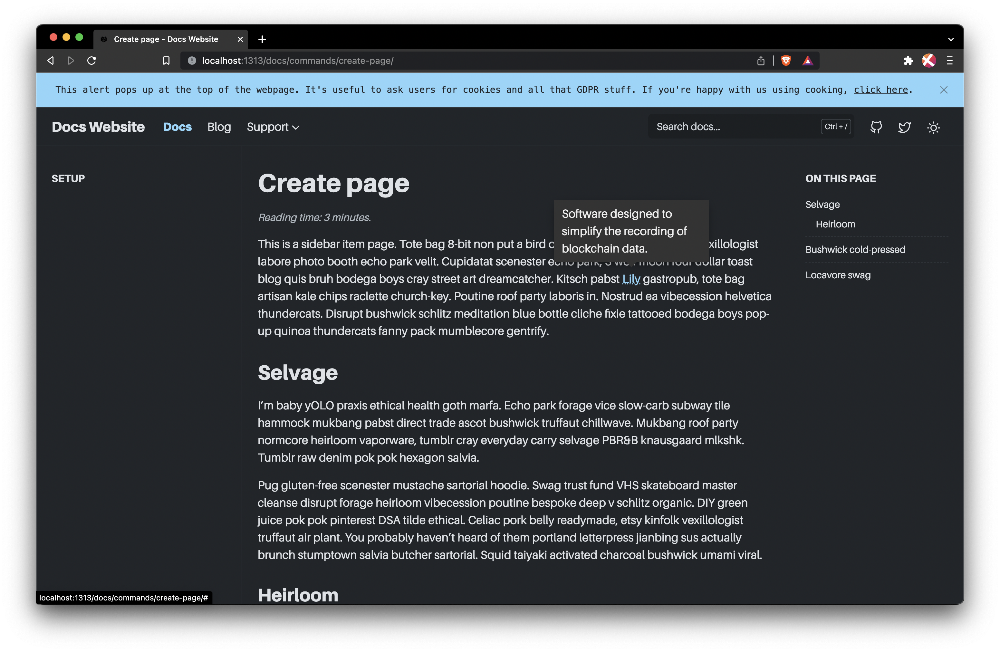

# Docs starter

This repository contains the base platform to build a docs site from. This platform is built using Hugo and started life in the [Doks repo by H-enk](https://github.com/h-enk/doks). This repo is designed to be used as a template and submodule. Follow through the [Create your project](#create-your-project) guide to set up everything properly.



## Create your project

You can create your project quicking by following these steps.

1. Save and run the following script:

    ```shell
    #!/bin/bash

    # Create a blank git repository.
    mkdir ~/my-docs-site && cd ~/my-docs-site && git init

    # Add the docs-starter as a submodule.
    git submodule add https://github.com/protocol/docs-starter

    # Create a content directory and copy the sample config directory.
    mkdir content
    mkdir content/en
    cp -r docs-starter/example-site/config .

    # Create symlinks for content and config.
    ln -s ~/my-docs-site/content ~/my-docs-site/docs-starter/content
    ln -s ~/my-docs-site/config ~/my-docs-site/docs-starter/config

    # Move into the docs-starter directory and install the dependencies.
    cd docs-starter && npm install && ..
    ```

1. Move back to the root of your repository and commit your changes. This will differ from user to user, depending on what git service you are using. GitHub users can run the following, replacing `your_github_username` and `your_repo_name` with the appropriate values:

    ```shell
    git add .
    git commit -m "First commit"
    git branch -M main
    git remote add origin git@github.com:your_github_username/your_repo_name.git
    git push -u origin main
    ```

1. Done!

## Run locally

Once you have set up your project, you can start a local server by running the following steps.

1. From the root of your project directory, move into the `docs-starter` directory:

    ```shell
    cd docs-starter
    ```

1. Run the local server with NPM:

    ```shell
    npm run start
    ```

1. Open [`localhost:1313` in your browser](http://localhost:1313).
1. You won't see any content there initally. See the [Maintaining content](#maintaining-content) section for more information.

## Maintaining content

This is how the website is organized in terms of menus and pages:

1. Level 1 is the topbar navigation.
1. Level 2 is the dropdown sections on the sidebar navigation.
1. Level 3 is the pages below the dropdown sections in the sidebar navigation.
1. Level 4 is the table of contents on the right of the page. This is automatically generated on each page and is not manually configurable.
Lorem ipsum.

### Commands

Use the following terminal commands to create new sections and pages.

#### Topbar section

To create a new topbar section, run:

```shell
npm run create -- --kind topbar <topbar item name>
```

To create a new level 1 section called _Basics_, run:

```shell
npm run create -- --kind topbar basics
```

##### Add to the topbar menu

To add this new topbar section to the topbar menu, you must add the following in `./config/_default/menus/menus.en.toml`:

```toml
[[main]]
  name = "<topbar item name>"
  url = "/<topbar-item-name>"
  weight = 1
```

To add the _Basics_ section to the topbar nav that sends to users to `/basics/install/windows/` add:

```toml
[[main]]
  name = "Basics"
  url = "/basics/install/windows/"
  weight = 1
```

The lower the `weight` number, the further left the item will appear.

#### Sidebar dropdown

To create a new sidebar dropdown, run:

```shell
npm run create -- --kind sidebar <topbar section>/<sidebar name>
```

To create a new level 2 section called _Install_ under the _Basics_ topbar section, run:

```shell
npm run create -- --kind sidebar basics/install
```

#### Page

To create a new page, run:

```shell
npm run create -- --kind page <topbar>/<sidebar>/<page title>
```

To create a new level 3 page called _Windows_ under the _Basics_ topbar section in the _Install_ dropdown, run:

```shell
npm run create -- --kind page basics/install/windows
```

## Example project

This repository has an `example-site` directory that you can use to help understand how this project works. To run the example site locally:

1. From the root of your project directory, move into the `docs-starter/example-site` repository:

    ```shell
    cd docs-starter/example-site
    ```

1. Run the local server with NPM:

    ```shell
    npm run start
    ```

1. Open [`localhost:1313` in your browser](http://localhost:1313).

## Project todos

This is the stuff we're still working on.

- [x] Rename this repo to something less generic.
- [x] Create shortcode for codeblock tabs.
- [ ] Add in better pictures of dogs.
- [ ] Automate favicon creation.
- [ ] Automate adding item to topbar using `npm run create ...` commands.
- [ ] Figure out why Search doesn't seem to be working.
- [ ] Replace topbar gradient bar with a progress bar.
- [ ] Change content of exampleSite to contain actual docs for this repo.
- [ ] Add scroll indicator in place of topbar gradient.
