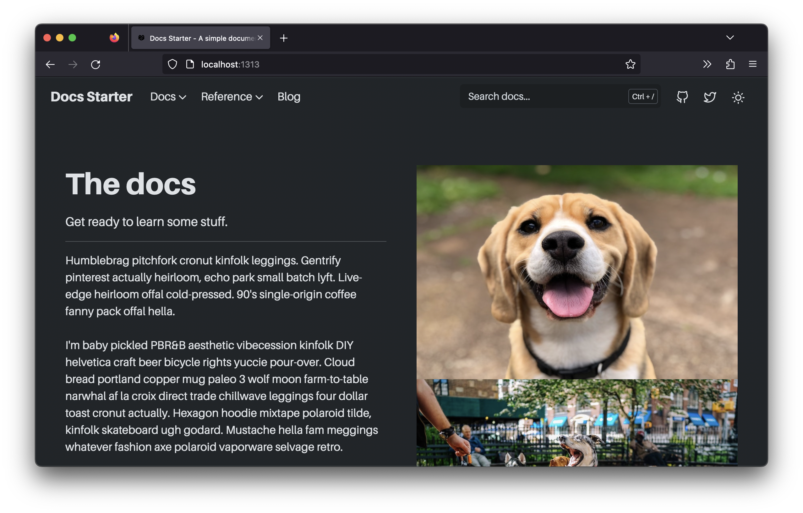

So you want to make a docs site.



Well you're in the right place. This repository contains everything you need to spin up a good looks documentation website _without_ a bunch of bloat that you don't need.

## Overview

Spinning up your site is crazy simple. Here's the basic process:

1. Grab the template repository from GitHub.
1. Clone your newly created repository down to your local computer:

    ```shell
    git clone https://github.com/<YOUR_USERNAME>/docs-starter
    ```

    ```plaintext
    A bunch of GitHub stuff...
    ...
    ...
    ```

1. Move into the `docs-starter` directory and `npm install` everything:
    <!-- TODO: grab output from `npm install`. -->

    ```shell
    cd docs-starter
    npm install
    ```

    ```plaintext
    Whatever `npm install` spits out. 
    ```

1. Done!

## Next steps

Your project is all set! Next up is [adding some pages]().
